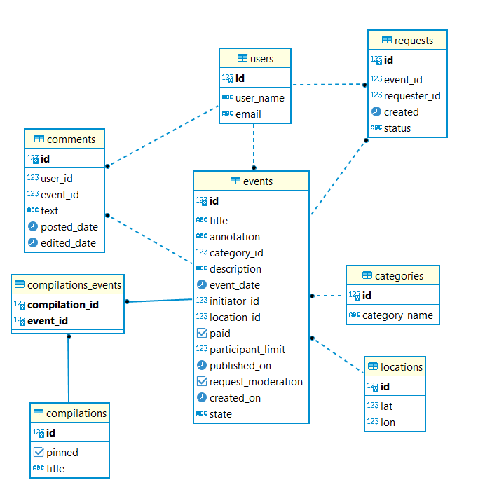

# java-explore-with-me
ExploreWithMe is an event guide app where users can post events, accept participants and attend events of other users. The app is developed using Microservices architecture.

# Stack
- Java-11
- Spring Boot
- Spring Data JPA
- PostgreSQL
- Maven
- Docker
- Lombok
- Apache HttpClient;
- REST

# Functionality

### Stats service

Registers and stores the number of views and provides data to analyse the app performance

### Main service
- Three access levels: public, user, admin;
- Adding, editing, deleting, viewing events;
- Adding, editing, deleting categories and compilations;
- Events moderation by admin;
- Various status for events;
- Events search and filter;
- Requests to join an event by users;
- Posting comments on an event.

# ER Diagram

# Requirements
- Java 11
- Docker
- PostgreSQL

# Developer
[Olga Obraztsova](https://github.com/olgaobraztsova)

# github PR
https://github.com/olgaobraztsova/java-explore-with-me/pull/5

